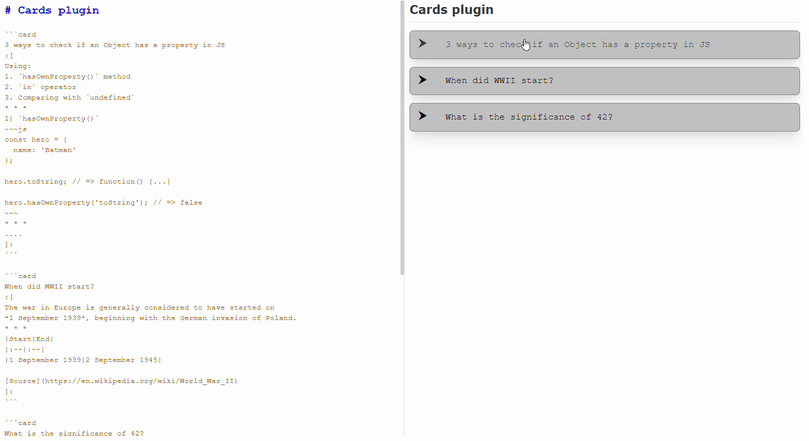

# Joplin Plugin - Spoiler cards

This Joplin plugin allows you to create cards with title and extendable body.

**Note**: Requires Joplin 1.7.0+
**Version**: 0.3.0



## Usage

In order to create a card, you need to write in this format:
```
:[
Card name here...

Card body text here...

]:
```
Please note, that the empty line above and below card body text is **needed**.

Card body supports markdown formatting as well.

### Example

```
:[
3 ways to check if an Object has a property in JS

Using:
1. `hasOwnProperty()` method
2. `in` operator
3. Comparing with `undefined`
* * *
1) `hasOwnProperty()`
~~~js
const hero = {
  name: 'Batman'
};

hero.toString; // => function() {...}

hero.hasOwnProperty('toString'); // => false
~~~
* * *

]:
```

## Custom styling of cards

If you would like to style the spoiler cards to your preference, use the following in your `userstyle.css` file:

```css
/* Styling of the card title */
.summary-title {
  
}

/* Styling of the card body */
.summary-content {
  
}
```

## Notes

- I have not thoroughly tested the plugin, so note that **there might be bugs**.
- I might have to change formatting in the future to improve highlighting in text editor, but nothing significant from now on.

> Created on 12th April 2021